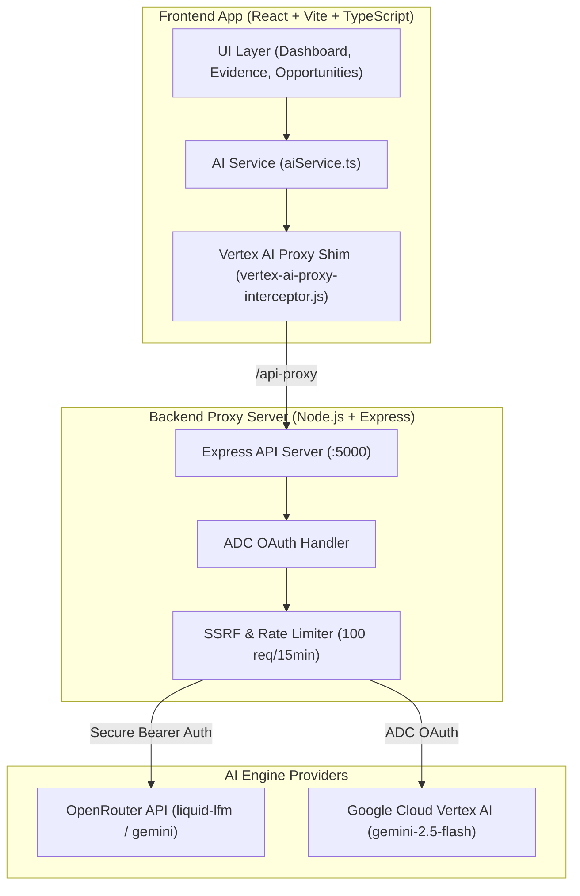

# Product Signal | AI Decision Workspace & Feedback Synthesis Engine

<div align="center">


[](https://www.typescriptlang.org/)
[](https://reactjs.org/)
[](https://vitejs.dev/)
[](https://nodejs.org/)
[](https://expressjs.com/)
[](https://openrouter.ai/)
[](https://cloud.google.com/vertex-ai)
[](https://opensource.org/licenses/MIT)

</div>

---

## 📌 Executive Summary

**Product Signal** is an enterprise-grade AI decision workspace designed to solve a multi-billion-dollar problem in modern Product Management: **turning chaotic, unstructured customer feedback into prioritized, evidence-backed product opportunities.**

Product Managers spend up to 15+ hours per week manually tagging support tickets, Gong transcripts, Typeform surveys, and app reviews. **Product Signal** automates this end-to-end pipeline:

1. **Ingests** unstructured text from multiple channels.
2. **Synthesizes** recurring pain points into statistically grounded themes using Large Language Models (`gemini-2.5-flash` / `liquid-lfm`).
3. **Validates** themes with direct evidence traceability (verbatim user quotes).
4. **Executes** decisions by converting insights into actionable Product Backlog Opportunities.

---

## 🎯 Key AI Product Management (AIPM) Competencies Showcase

This project was architected to demonstrate core competencies required of senior **AI Product Managers** and **Lead AI Product Designers**:

### 1. 🤖 Structured AI Outputs & Zero-Hallucination Schemas
Rather than relying on unstructured conversational responses, Product Signal enforces strict JSON schema validation. Every AI synthesis output generates quantitative metadata:
- **Confidence Score (0–100%)**: Evaluates signal clarity across feedback items.
- **Trend Velocity Metrics**: Tracks volume growth (`+28% this month`) and urgency (`Emerging Signal`).
- **Target Customer Segments**: Automatically infers affected tiers (`Enterprise`, `New Users`, `All`).

### 2. 🔍 Explainable AI (XAI) & Evidence Traceability
Enterprise PMs cannot trust "black box" AI predictions. Product Signal implements explicit **Evidence Traceability** (`feedbackIds`). Every synthesized theme is linked to exact customer quotes, giving PMs 100% confidence before allocating engineering budget.

### 3. 🔄 Closed-Loop Product Execution
Analysis without action is meaningless. Product Signal bridges data to execution by allowing PMs to convert synthesized themes into **Opportunity Cards** on an interactive Kanban board (`New` ➔ `Investigating` ➔ `Prioritized` ➔ `Rejected`).

---

## 🎨 Product Design & UX System Architecture

Designed with a modern, high-density enterprise SaaS visual language inspired by platforms like Linear, Dovetail, and Productboard:

```
┌─────────────────────────────────────────────────────────────────────────────┐
│                            PRODUCT SIGNAL UX SYSTEM                         │
├─────────────────┬───────────────────────────────────────────────────────────┤
│ Navigation      │ • Overview Dashboard (KPI Cards & Emerging Signals)       │
│ Sidebar         │ • Import Data (Bulk text ingestion engine)                │
│ (Responsive)    │ • AI Insights (Themes breakdown & trend metrics)          │
│                 │ • Evidence View (Verbatim quotes & XAI traceability)      │
│                 │ • Opportunities Board (Kanban workflow & prioritization)  │
└─────────────────┴───────────────────────────────────────────────────────────┘
```

- **Visual Tokens**: Slate neutrals (`#0f172a`), curated primary blue (`#3b82f6`), status-driven badges (`Emerging Signal`, `High Impact`).
- **Typography**: Inter system font stack optimized for scannable dashboard metrics.
- **Accessibility**: Focus-visible rings, ARIA landmark roles, responsive drawer menus for mobile/desktop viewports.

---

## ⚙️ Technical System Architecture

Product Signal uses a decoupled, secure client-proxy architecture:



---

## 🛡️ Security & Privacy Safeguards

- **No Exposed API Keys in Client**: Secret keys are kept server-side or passed via environment variables.
- **SSRF & Host Name Validation**: Backend proxy enforces strict allow-lists for Google Cloud endpoints (`aiplatform.clients6.google.com`) and OpenRouter APIs.
- **Rate Limiting**: Protected by `express-rate-limit` to prevent DoS attacks and unexpected API cost spikes.
- **Header Shimming**: Requires `X-App-Proxy` token validation to block unauthorized origin requests.

---

## 🚀 1-Click Quick Start Guide

### Prerequisites
- **Node.js**: `v18.0.0` or higher installed ([Download Node.js](https://nodejs.org/))
- **Git**: Installed on your system

### ⚡ 1-Click Launch (Windows)
Simply double-click **[`run.bat`](file:///f:/Antigravity/product-signal/run.bat)** in the root folder!
It will:
1. Validate Node.js installation.
2. Install `node_modules` automatically if missing.
3. Start both Frontend (`:5173`) and Backend (`:5000`) concurrently.
4. Launch `http://localhost:5173` automatically in your web browser.

---

### 💻 Manual Command Line Setup

1. **Clone the Repository**:
   ```bash
   git clone https://github.com/originsatyam/product-signal.git
   cd product-signal
   ```

2. **Install Dependencies**:
   ```bash
   npm install
   ```

3. **Configure Environment Variables**:
   Copy `.env.example` to `backend/.env.local`:
   ```bash
   cp backend/.env.example backend/.env.local
   ```
   Add your OpenRouter API Key:
   ```env
   OPENROUTER_API_KEY=your_openrouter_api_key_here
   ```

4. **Run Dev Servers**:
   ```bash
   npm run dev
   ```
   Open [http://localhost:5173](http://localhost:5173) in your browser.

---

## 🔑 Environment Variables Reference

| Variable | Description | Default | Location |
| :--- | :--- | :--- | :--- |
| `OPENROUTER_API_KEY` | OpenRouter API authentication key | - | `backend/.env.local` |
| `API_BACKEND_HOST` | Host interface for Node proxy | `127.0.0.1` | `backend/.env.local` |
| `API_BACKEND_PORT` | Port for Express backend server | `5000` | `backend/.env.local` |
| `GOOGLE_CLOUD_PROJECT` | GCP Project ID for Vertex AI | `global` | `backend/.env.local` |

---

## 🗺️ Product Strategy & Future Roadmap

- [ ] **Multi-Channel Integrations**: Direct webhooks for Zendesk, Gong, Typeform, Slack, and Intercom.
- [ ] **Multimodal Voice Notes**: Audio transcription and sentiment analysis for customer interview recordings.
- [ ] **Jira / Linear Auto-Sync**: 1-Click export of Opportunity Cards directly into Jira backlog.
- [ ] **Custom LLM Fine-Tuning**: Support for domain-specific fine-tuned models for specialized industry verticals (Fintech, Healthtech).

---

## 👤 Author & Maintainer

**Satyam**
- 🐙 GitHub: [@originsatyam](https://github.com/originsatyam)
- ✉️ Email: origin.satyam@gmail.com

---

<div align="center">
  <sub>Built with ❤️ for AI Product Managers & Designers worldwide.</sub>
</div>
