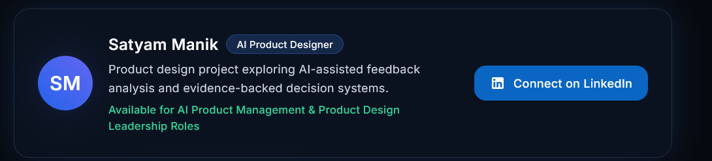

 Don't use the word AI product design, you could use AI UX design. Also don't mention AI product management and all. I am applying for AI UX designing. 

use the real picture ok for profile : 

could you make it more visuals presentation or what you think this is enough 